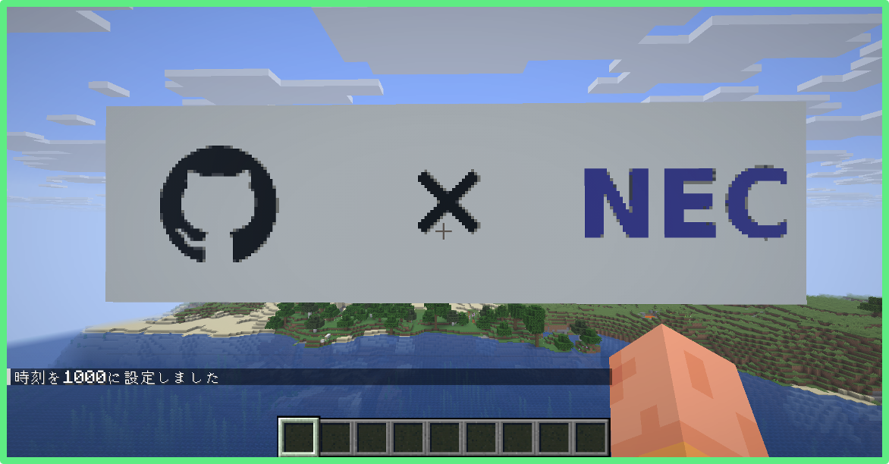
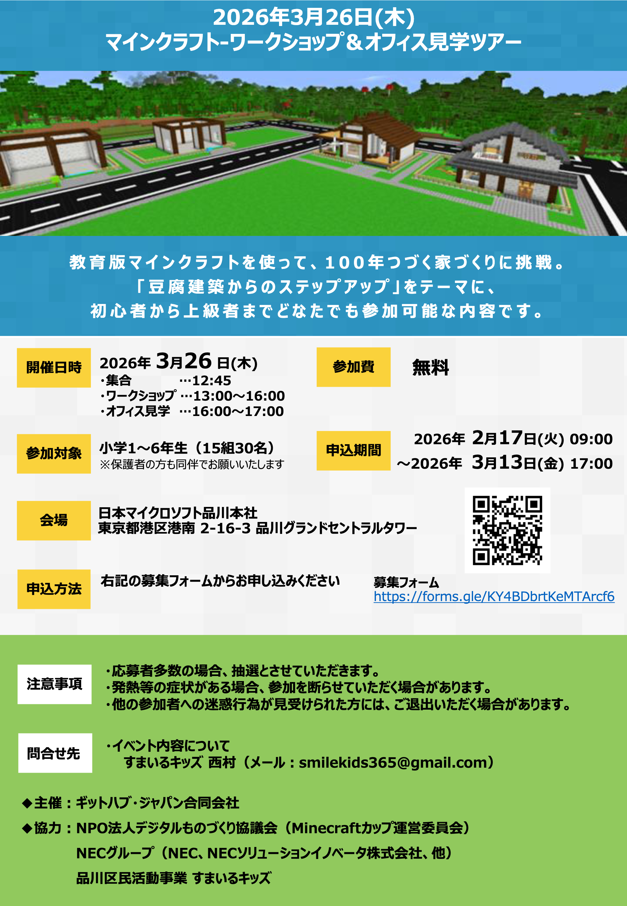
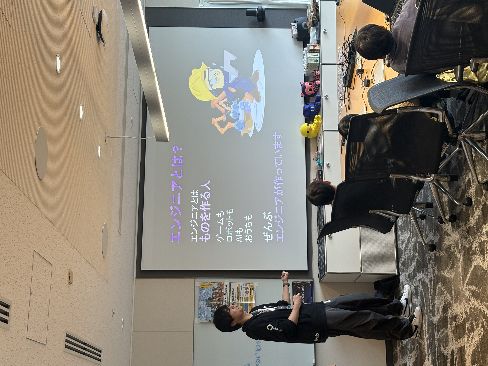
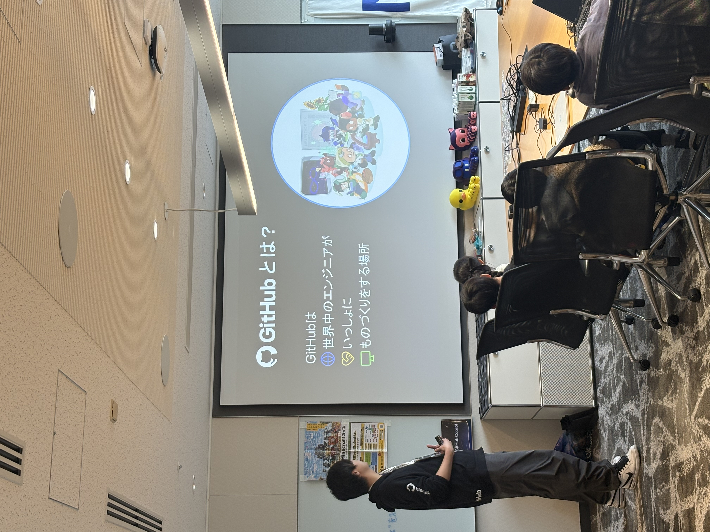
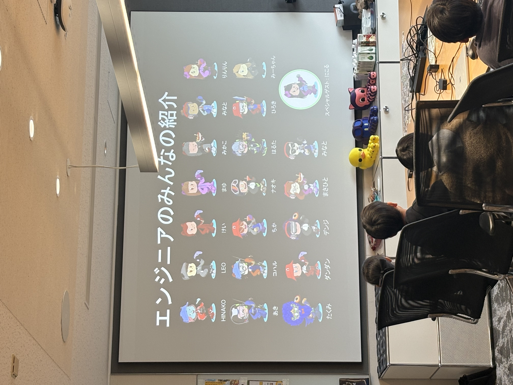
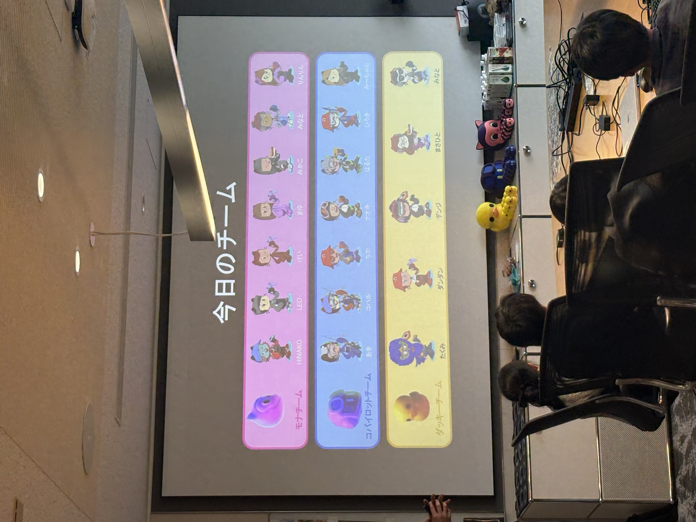
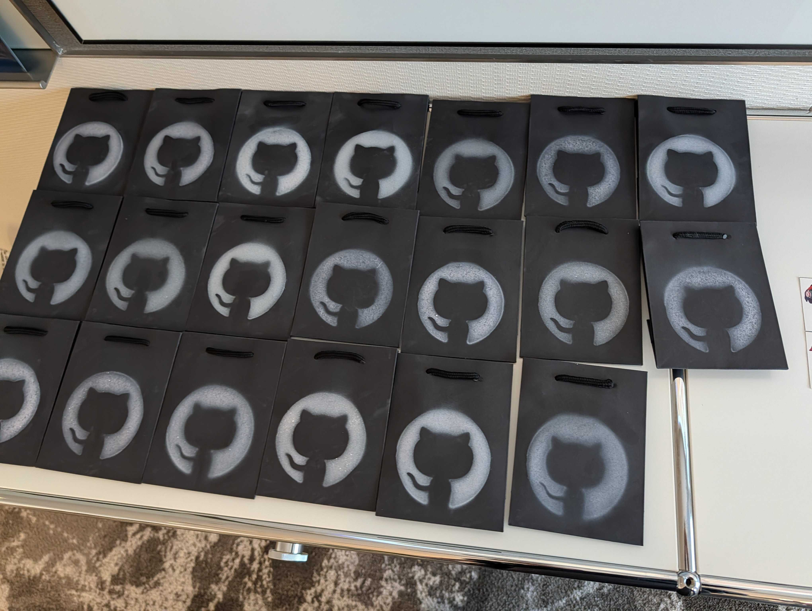
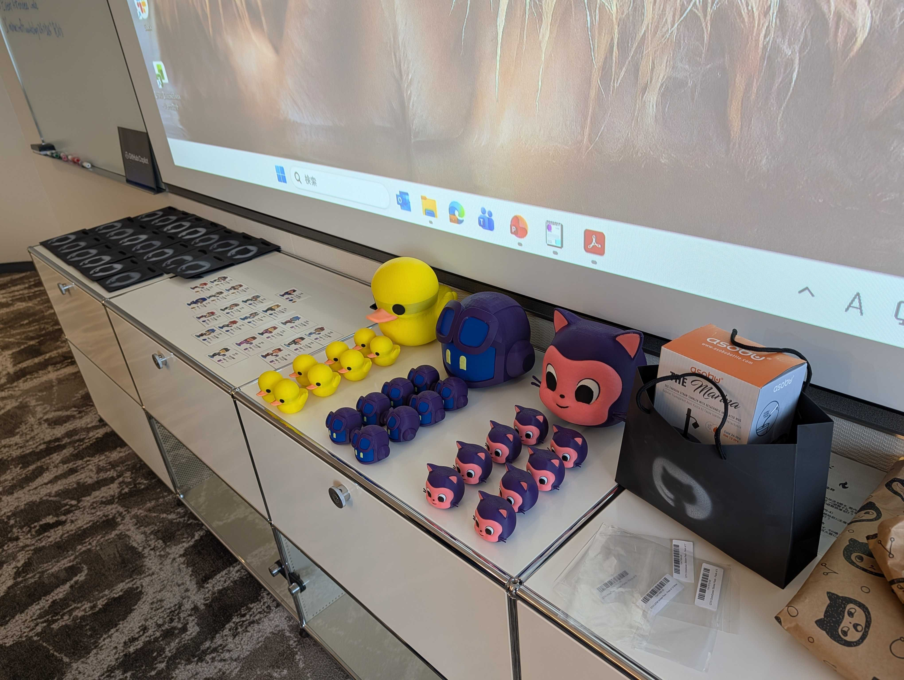
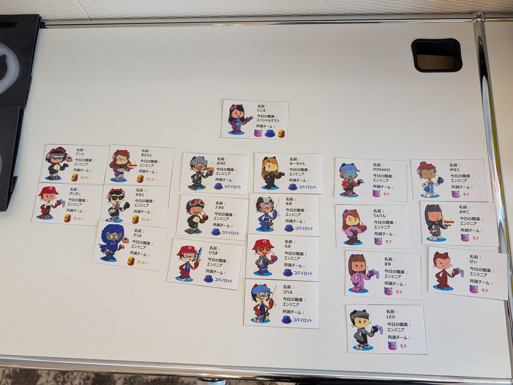

# 🎮 GitHub × NEC マインクラフトワークショップ & オフィス見学ツアー

📖 [English version →](README_EN.md)

> **2026年3月26日（木）13:00〜17:00 ｜ マイクロソフト品川オフィス（東京）**

GitHub Japan Corp Teamのボランティア活動として、NEC株式会社と共同で小学生向けのMinecraft Educationワークショップ＆オフィス見学ツアーを開催しました。本リポジトリは、その活動記録です。

---

## 📋 イベント概要

| 項目 | 内容 |
|------|------|
| **イベント名** | マインクラフト教育ワークショップ & オフィス見学ツアー |
| **日時** | 2026年3月26日（木）13:00〜17:00 JST |
| **場所** | マイクロソフト品川オフィス（東京） |
| **主催** | GitHub Japan Corp Team（ボランティアリーダー：谷野 恭介） |
| **協力** | NEC株式会社 |
| **総参加者** | **55名** |
| **対象** | 小学生とその保護者 |

### 参加者内訳

| グループ | 人数 |
|----------|------|
| 子どもたち | 19名 |
| 保護者 | 15名 |
| 品川区役所関係者 | 2名 |
| 特別ゲスト | 2名 |
| NECボランティア | 7名 |
| GitHubボランティアリーダー | 1名 |
| GitHubボランティア | 9名 |
| **合計** | **55名** |

---

## 🌟 背景

2025年11月頃、GitHub Japan Corp Teamで**子どもたちのためになる教育活動をしたい**という思いからスタートしました。何か子どもたちの未来に貢献できるボランティア活動ができないかと模索する中で、NEC様からお声がけいただき、共同でこのイベントを企画・実現しました。

**Minecraft Education Edition** をワークショップのプラットフォームとして採用し、マイクロソフト品川オフィスの見学ツアーも組み合わせることで、子どもたちにエンジニアの仕事を体感してもらいました。

募集には約**60件**の応募があり、PC台数の制限から**19名**を選抜しました。

---

## 🎯 イベントプログラム

### 1. オープニングプレゼンテーション（10分）
子どもたちに「今日はみんなエンジニアになります！」と紹介。GitHubが世界中のエンジニアをつなぐ会社であること、そして今日はみんなで力を合わせてモノづくりを体験する日であることを伝えました。

|  |  |
|:---:|:---:|
| エンジニアとは？ | GitHubとは？ |
|  |  |
| 参加者とゲストの紹介 | チーム分けの紹介 |

### 2. マインクラフトワークショップ —「100年もつ家を建てよう」🏠
- 3チーム（Mona、Copilot、Ducky）に分かれて活動
- テーマ：「100年もつ快適な家をデザインしよう」
- チームで話し合い、役割分担して**共同で大きな家を建設**
- 各チームが自分たちのワールドを発表

### 3. 特別ゲストトーク — 近藤にこるさん 🎤
- 13歳の起業家、近藤ニコルさんが**マインクラフト全国大会**の経験やAI教育への関心を語りました
- 子どもたちから多くの質問が飛び交う、インタラクティブなセッションに

### 4. マイクロソフトオフィスツアー 🏢
- ジャングルテーマの空間や卓球台、ダーツエリアに子どもたちは大興奮
- 保護者からも「ずっと来てみたかった！」との声

### 5. スペシャルギフト 🎁
参加してくれた子どもたち全員に、手作りのスペシャルギフトを用意しました。

| # | ギフト |
|---|--------|
| 1 | GitHub Copilot CLIで作ったカスタムギフトバッグ |
| 2 | 3Dプリントされたキャラクター（Mona / Copilot / Ducky） |
| 3 | ディズニーワールドのお菓子 |
| 4 | オリジナルネームバッジ（自作Octocat付き） |
| 5 | GitHubステッカー |

|  |  |  |
|:---:|:---:|:---:|
| カスタムギフトバッグ | 3Dプリントキャラクター | オリジナルネームバッジ |

### 6. サプライズデモ — Minecraft × GitHub Copilot CLI 🤖
閉会前に、GitHub Copilot CLIを使って**GitHubのオクトキャットをマインクラフトの世界にGIFアニメーションとして登場させるデモ**を披露しました。最近のAIエンジニアがどんなことをしているのか、ちょっぴり体験してもらいました。

| 元のGIF | Minecraftで再生 |
|:-------:|:---------------:|
|  |  |

🔗 [copilot-cli-minecraft-experiment2](https://github.com/ktanino10/copilot-cli-minecraft-experiment2)

---

## 📊 アンケート結果（15件の回答）

> 📌 アンケートダッシュボードは [こちら](https://ktanino10.github.io/github-nec-minecraft-workshop-2026/survey/) からご覧いただけます。画面上の **JP / EN** ボタンで日本語・英語の切替が可能です。
>
> 💡 *このダッシュボードは GitHub Copilot CLI を使って約5分で作成しました。*

### 総合スコア（5.0点満点）

| カテゴリ | 平均スコア |
|----------|------------|
| 総合満足度 | **4.87** ⭐ |
| 他者への推薦度 | **4.80** ⭐ |
| 期待との一致度 | **4.60** ⭐ |
| 再参加意向 | **4.67** ⭐ |
| 教育的価値 | **4.67** ⭐ |

### GitHub認知度（イベント前）

> **64%** の参加者がイベント前にGitHubを知らなかった — このワークショップを通じて初めてGitHubを知る機会となりました。

---

## 💬 参加者の声（抜粋）

> *「みんなで協力して1つのものを作り上げる過程を体験できて、小学生にこのような経験をさせてもらえたのが素晴らしかった。」* — 保護者

> *「無料のイベントとは思えないクオリティでした。マイクロソフトのオフィスも見学できて感動しました。ありがとうございます！」* — 保護者

> *「改善してほしいところは…こんなに素晴らしいイベントなので思いつきません！」* — 子ども参加者

> *「大人も楽しめました！本当に貴重な機会をありがとうございました。」* — 保護者

---

## 📈 主な成果

| 指標 | 結果 |
|------|------|
| 🎯 総合満足度 | **4.87 / 5.0**（97.4%） |
| 📣 推薦度 | **4.80 / 5.0**（96.0%） |
| 🆕 GitHub新規認知 | **64%** が初めてGitHubを知った |
| 👥 企業間連携 | NEC（7名のボランティア）との共同開催 |
| 🏛️ 地域連携 | 品川区から2名の職員が参加 |
| 📊 応募倍率 | 約60件の応募 → 19名選抜（約3:1） |

---

## 🌍 ワールド配布について

ワークショップで子どもたちが作成したMinecraftワールドの配布を検討しましたが、**Minecraft Education Editionの利用規約・ライセンス規定**により、ワールドデータの外部配布は難しいと判断しました。そのため、本リポジトリからのワールドデータ配布は行っておりません。ご了承ください。

---

## 📁 このリポジトリに含まれるファイル

| ファイル | 説明 |
|----------|------|
| [📄 flyer.pdf](flyer.pdf) | イベント募集チラシ |
| [📊 survey/index.html](https://ktanino10.github.io/github-nec-minecraft-workshop-2026/survey/) | アンケート結果ダッシュボード（GitHub Pages）— JP / EN ボタンで日英切替可能 |
| [🖼️ necgithublogo.png](necgithublogo.png) | GitHub × NEC マインクラフト内ロゴ |

---

## 🔗 関連リポジトリ・リンク

| リソース | リンク |
|----------|--------|
| Octocat スプレーガード（3Dプリント） | [octocat-spray-guard](https://github.com/ktanino10/octocat-spray-guard) |
| Copilot CLI CAD 実験 | [copilot-cli-cad-experiment](https://github.com/ktanino10/copilot-cli-cad-experiment) |
| Minecraft × Copilot CLI デモ | [copilot-cli-minecraft-experiment](https://github.com/ktanino10/copilot-cli-minecraft-experiment) |
| YouTube デモ動画 | [youtube.com](https://www.youtube.com/watch?v=fOD_9N9I8m8) |
| MyOctocat Builder | [myoctocat.com](https://myoctocat.com/build-your-octocat/) |

---

*記録者：谷野 恭介 — ボランティアリーダー、GitHub Japan Corp Team*
*イベント開催日：2026年3月26日*
