# 🎮 GitHub × NEC Minecraft Workshop & Office Tour

📖 [日本語版 →](README.md)

> **March 26, 2026 (Thu) 13:00–17:00 ｜ Microsoft Shinagawa Office, Tokyo, Japan**

As a volunteer activity of the GitHub Japan Corp Team, we organized a Minecraft Education Workshop & Office Tour in collaboration with NEC Corporation, targeting elementary school children. This repository serves as an activity log.

---

## 📋 Event Overview

| Detail | Information |
|--------|------------|
| **Event Name** | Minecraft Education Workshop & Office Tour |
| **Date & Time** | March 26, 2026 (Thu), 13:00–17:00 JST |
| **Location** | Microsoft Shinagawa Office, Tokyo, Japan |
| **Organized by** | GitHub Japan Corp Team (Volunteer Leader: Kyosuke Tanino) |
| **Partner** | NEC Corporation |
| **Total Participants** | **55 people** |
| **Target Audience** | Elementary school children and their parents |

### Participant Breakdown

| Group | Count |
|-------|-------|
| Children | 19 |
| Parents | 15 |
| Shinagawa Ward Officials | 2 |
| Special Guests | 2 |
| NEC Volunteers | 7 |
| GitHub Volunteer Leader | 1 |
| GitHub Volunteers | 9 |
| **Total** | **55** |

---

## 🌟 Background

Around November 2025, it all started with a desire to **do something meaningful for children's education** through the GitHub Japan Corp Team. While exploring ways to contribute to children's futures through volunteer activities, NEC Corporation reached out to us, and together we planned and brought this event to life.

We chose **Minecraft Education Edition** as the workshop platform and combined it with a tour of the Microsoft Shinagawa Office, giving children a firsthand experience of what it's like to be an engineer.

We received approximately **60 applications** — due to limited PC availability, **19 children** were selected.

---

## 🎯 Event Program

### 1. Opening Presentation (10 min)
We started by asking: *"What is an engineer?"* — someone who builds things and solves problems — and told the children that today, they would all become engineers. We then introduced **GitHub**, a company that connects engineers around the world, and **NEC**, our partner in organizing this event. Next, we introduced all the participating children (a.k.a. today's engineers!) and our special guest, Nicole Kondo. We wrapped up with a rallying call: *"Let's work together and build something amazing!"* — and the children split into three teams: **Mona, Ducky, and Copilot** to kick off the workshop.

|  |  | 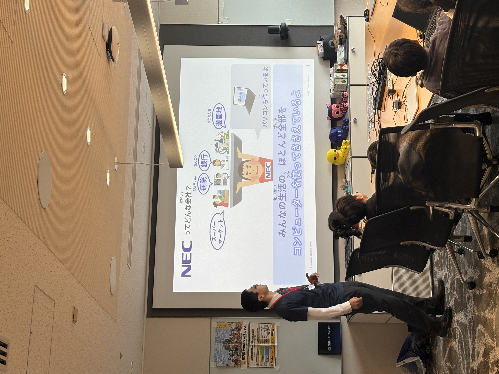 |
|:---:|:---:|:---:|
| What is an Engineer? | What is GitHub? | What is NEC? |
|  |  | |
| Introducing Participants & Guest | 3 Teams Ready to Go! | |

### 2. Minecraft Workshop — "Build a House That Lasts 100 Years" 🏠
- Divided into **3 teams** (Mona, Copilot, Ducky)
- Theme: *"Design a comfortable home that can last 100 years"*
- Teams discussed ideas, assigned roles, and **collaboratively built a large house**
- Each team presented their world to the group

| 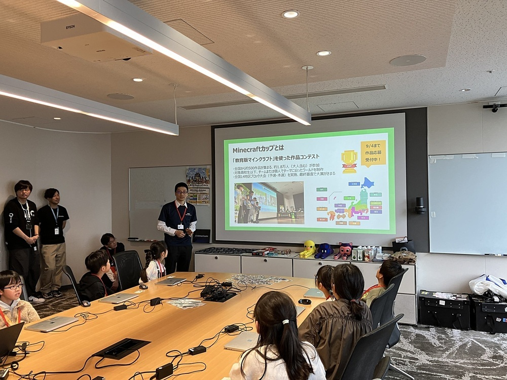 | 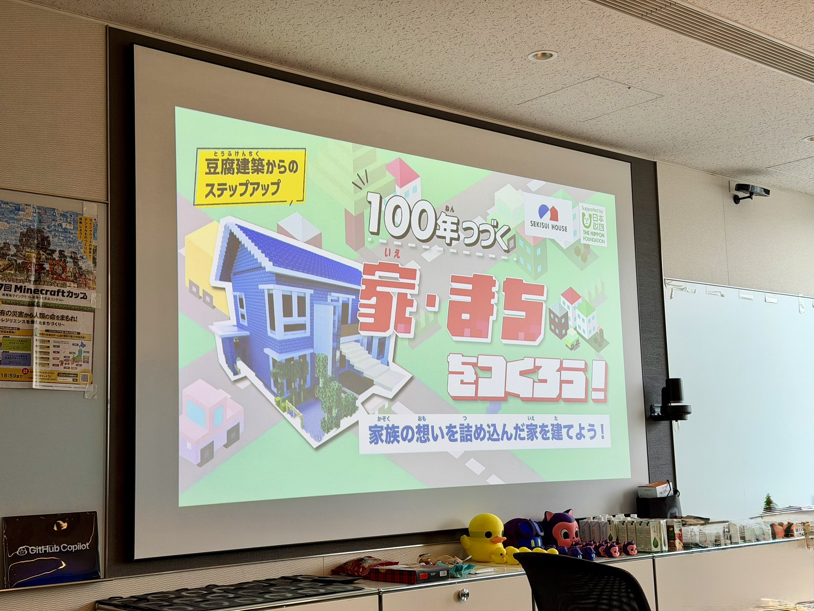 | 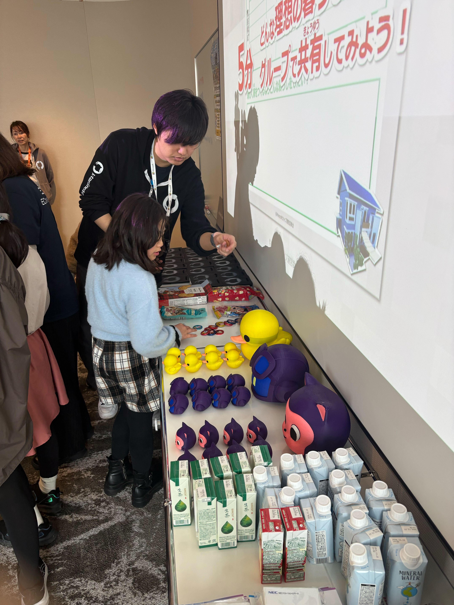 |
|:---:|:---:|:---:|
| NEC's Nishimura introduces the Minecraft Cup | Theme Introduction | Picking snacks from Walt Disney World, Florida |
| 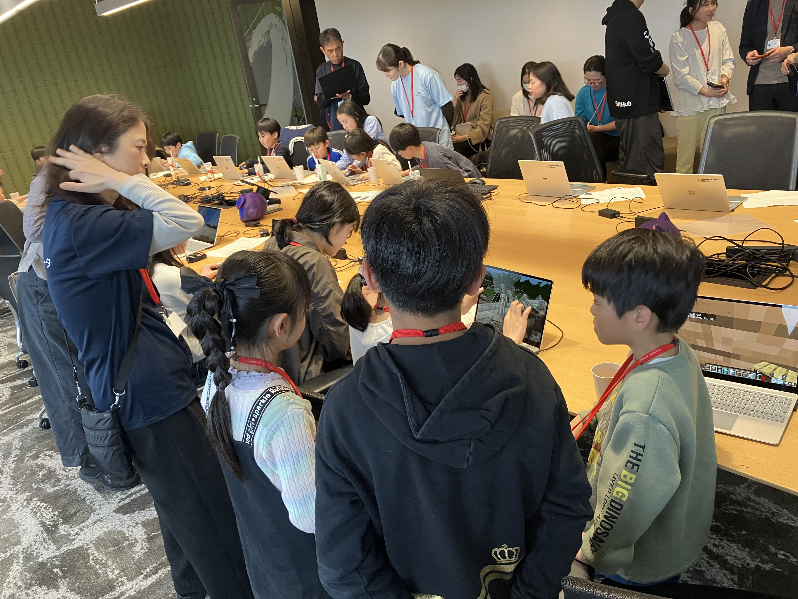 | 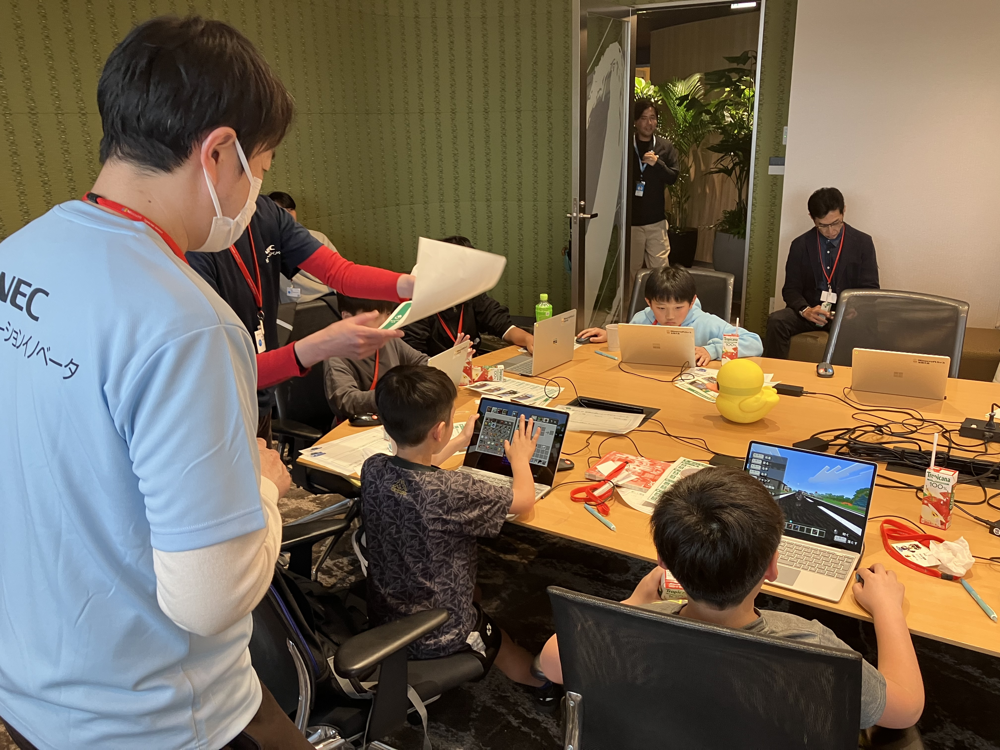 | 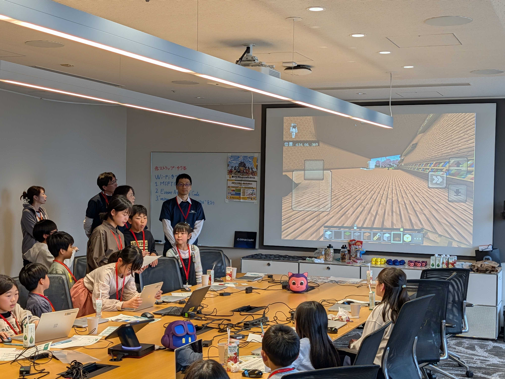 |
| Teams collaborating together | NEC staff providing hands-on support to kids | Presenting their creations to everyone |

### 3. Special Guest Talk — Nicole Kondo 🎤
- **Nicole Kondo**, a 13-year-old entrepreneur, shared her experience competing in the **Minecraft National Championship**
- She also spoke about her various passions and her journey toward **AI-related education and entrepreneurship**
- A highly interactive session with many questions from the children

| 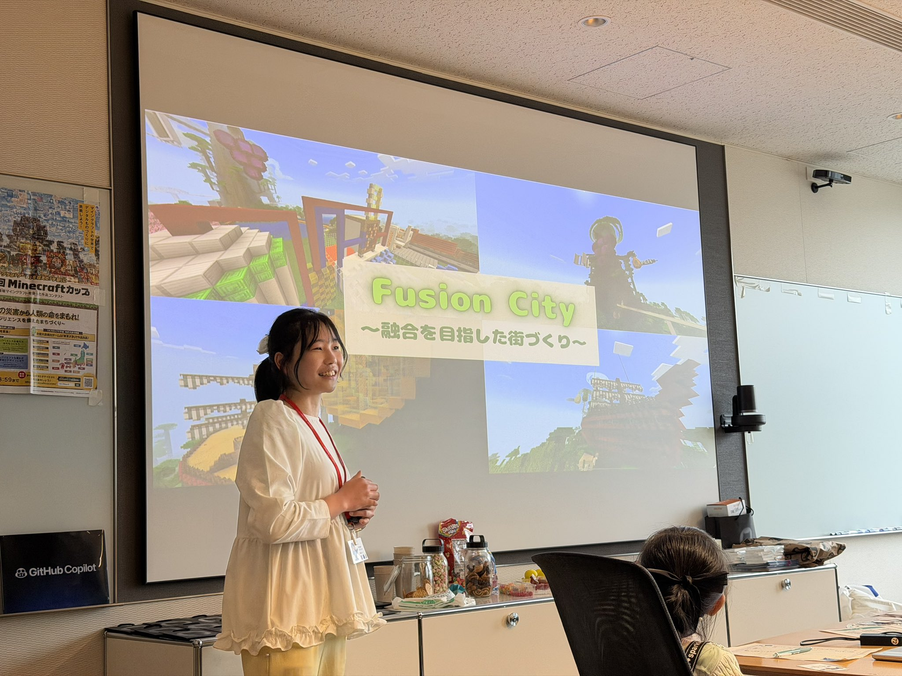 |
|:---:|
| Nicole sharing her Minecraft National Championship experience |

### 4. Microsoft Office Tour 🏢
- Not only the children, but **parents and NEC staff alike were all thrilled** during the office tour
- GitHub actually has many former Microsoft employees, and one of them served as the tour guide
- The office featured amazing facilities: a cafeteria, ping pong tables, billiards, darts, mini-golf, a gym, a theater room, and more
- Unlimited juice and snacks for everyone — the kids had a blast!
- We can't share detailed photos of the office interior for security reasons, but **if you're curious, please join our next event around August!**

| 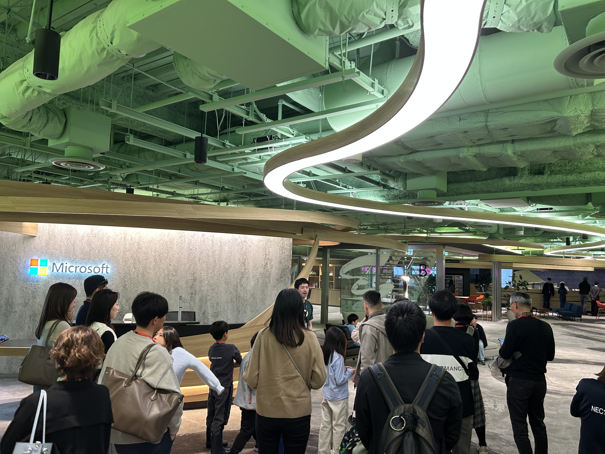 |
|:---:|
| Office Tour |

### 5. Special Gifts 🎁
We prepared handmade special gifts for every child who participated.

| # | Gift |
|---|------|
| 1 | Custom GitHub Copilot CLI gift bags |
| 2 | 3D-printed characters (Mona / Copilot / Ducky) |
| 3 | Snacks from Walt Disney World, Florida |
| 4 | Personalized name badges with custom Octocats |
| 5 | GitHub stickers |

|  |  |  |
|:---:|:---:|:---:|
| Custom Gift Bags | 3D-Printed Characters | Personalized Name Badges |

### 6. Surprise Demo — Minecraft × GitHub Copilot CLI 🤖
Before closing, I surprised the children with a demo showing **GitHub's Octocat brought to life as a GIF animation inside the Minecraft world** using GitHub Copilot CLI — giving them a little glimpse of what AI engineers are doing these days.

| Original GIF | Playback in Minecraft |
|:------------:|:---------------------:|
|  |  |

🔗 [copilot-cli-minecraft-experiment2](https://github.com/ktanino10/copilot-cli-minecraft-experiment2)

### 7. Group Photos 📸
To wrap things up, we all took a group photo! As you can see in the photos, the 3D-printed **Mona, Ducky, and Copilot** figures were a huge hit. ※ Each figure took a full two days to 3D-print, and the printer was running loudly above my head, so I lost about a week of sleep… but seeing the children's smiles made it all worthwhile.

| 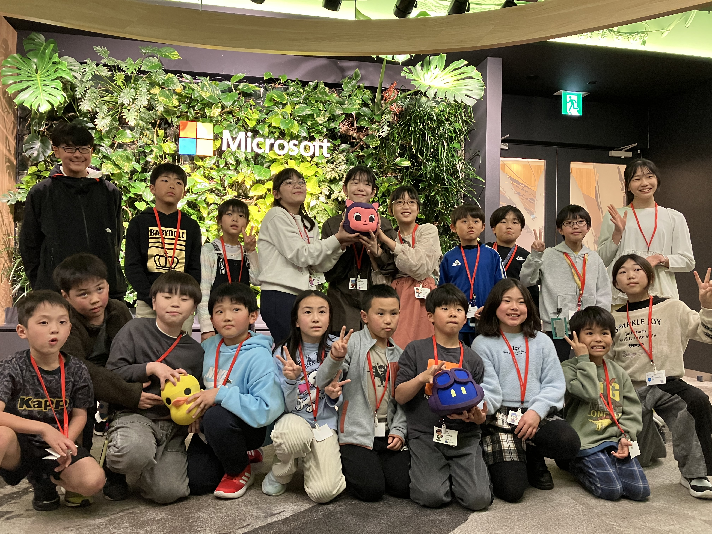 |  |
|:---:|:---:|
| Kids & Nicole — Mona, Ducky & Copilot were a huge hit! | NEC volunteers (and I joined in too) |

| 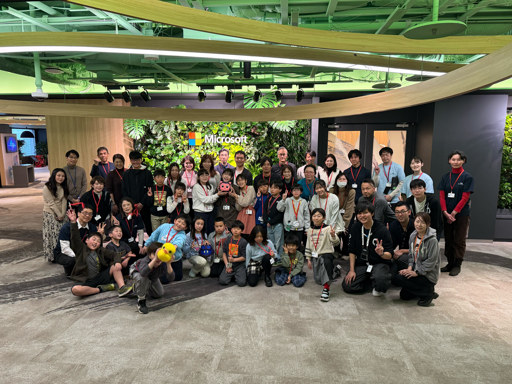 |
|:---:|
| Group photo — 55 participants, parents, volunteers & guests |

---

## 📊 Post-Event Survey Results (15 responses)

> 📌 View the full survey dashboard [here](https://ktanino10.github.io/github-nec-minecraft-workshop-2026/survey/). Use the **JP / EN** buttons to switch between Japanese and English.
>
> 💡 *This dashboard was built in approximately 5 minutes using GitHub Copilot CLI.*

### Overall Scores (out of 5.0)

| Category | Avg Score |
|----------|-----------|
| Overall Satisfaction | **4.87** ⭐ |
| Would Recommend to Others | **4.80** ⭐ |
| Met Expectations | **4.60** ⭐ |
| Would Participate Again | **4.67** ⭐ |
| Educational Value | **4.67** ⭐ |

### GitHub Awareness Before the Event

> **64%** of participants had never heard of GitHub before this event — this workshop successfully introduced GitHub to a brand-new audience of families and children.

---

## 💬 Selected Participant Feedback

> *"Experiencing the process of collaborating and achieving something together — it was great that elementary school kids could have this experience."* — Parent

> *"The quality was unbelievable for a free event. We could also tour the Microsoft office. Thank you!"* — Parent

> *"It was such a wonderful event that I can't think of any improvements!"* — Child participant

> *"Adults enjoyed it too! Thank you for this invaluable opportunity."* — Parent

---

## 📈 Key Achievements

| Metric | Result |
|--------|--------|
| 🎯 Overall Satisfaction | **4.87 / 5.0** (97.4%) |
| 📣 Would Recommend | **4.80 / 5.0** (96.0%) |
| 🆕 New GitHub Awareness | **64%** learned about GitHub for the first time |
| 👥 Cross-Company Collaboration | Partnered with **NEC** (7 volunteers) |
| 🏛️ Community Engagement | **Shinagawa Ward** sent 2 officials |
| 📊 Application Demand | ~60 applications for 19 spots (~3:1 ratio) |

---

## 🌍 About World Distribution

We considered distributing the Minecraft worlds created by the children during the workshop. However, due to **Minecraft Education Edition licensing and usage regulations**, external distribution of world data was not feasible. Therefore, **no world data is distributed from this repository**. Thank you for your understanding.

---

## 📁 Files in This Repository

| File | Description |
|------|-------------|
| [📄 flyer.pdf](flyer.pdf) | Event recruitment flyer |
| [📊 survey/index.html](https://ktanino10.github.io/github-nec-minecraft-workshop-2026/survey/) | Survey results dashboard (GitHub Pages) — Switch JP / EN with buttons |
| [🖼️ necgithublogo.png](necgithublogo.png) | GitHub × NEC logo built in Minecraft |

---

## 🔗 Related Repositories & Links

| Resource | Link |
|----------|------|
| Octocat Spray Guard (3D Print) | [octocat-spray-guard](https://github.com/ktanino10/octocat-spray-guard) |
| Copilot CLI CAD Experiment | [copilot-cli-cad-experiment](https://github.com/ktanino10/copilot-cli-cad-experiment) |
| Minecraft × Copilot CLI Demo | [copilot-cli-minecraft-experiment](https://github.com/ktanino10/copilot-cli-minecraft-experiment) |
| YouTube Demo Video | [youtube.com](https://www.youtube.com/watch?v=fOD_9N9I8m8) |
| MyOctocat Builder | [myoctocat.com](https://myoctocat.com/build-your-octocat/) |

---

*Recorded by Kyosuke Tanino — Volunteer Leader, GitHub Japan Corp Team*
*Event Date: March 26, 2026*

---

## 🙏 Acknowledgments

This event was made possible by the support and collaboration of many wonderful people. We extend our heartfelt thanks to everyone involved.

- **GitHub Team Members** — who dedicated themselves fully to planning, preparation, and operations as volunteers
- **NEC Corporation** volunteers — who provided warm, hands-on support for the children from co-planning through the day of the event
- **Nicole Kondo & her father** — who joined as special guests and shared invaluable experiences with the children
- **Shinagawa Ward Office** officials — who came to support the children in the local community
- **Microsoft Japan** — who provided an amazing event space and made the office tour possible

Thanks to everyone, we were able to create an unforgettable day for the children. Thank you so much!

---

## 📣 Activity Reports & Related Posts

### Smile Kids
- 📘 [Facebook — Smile Kids](https://www.facebook.com/smilekids365/)
- 🌐 [Shinagawa Smile Net — Activity Report](https://pc.tamemap.net/1310901/activities/13109010114/reports/9139)

### Nicole Kondo (CEO, EdFusion Inc.)
- 🐦 [Post on X (formerly Twitter)](https://x.com/Nikoru2024/status/2037104165122670740) — *"Today was a truly special day. NEC invited me to speak at a Minecraft event — and GitHub was there too!"*
